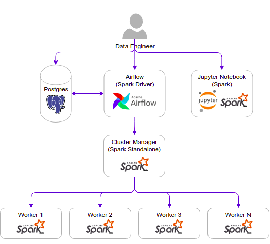

[](https://classroom.github.com/a/_aSeI9v2)
[](https://classroom.github.com/online_ide?assignment_repo_id=12736604&assignment_repo_type=AssignmentRepo)
# DE-101-Project

Project for DE-101 Course

## Project Objective

The objective of this project is to consume data from the Nike API provided on the nikescrapi.py file, build a data pipeline to insert the API data into a data warehouse, and create a data warehouse structure to store the data. Finally, we will write necessary queries to make reports from the data warehouse.

The project is divided into the following phases:

1. **Data Ingestion**:
In this phase, we will ingest the data from the Nike API provided in the nikescrapi.py file.
2. **Data Processing**:
In this phase, we will process the data using airflow as orchestrator or any other tool or framework. We will clean, transform, and aggregate the data as per the requirements.
3. **Data Ingestion into Data Warehouse**:
In this phase, we will ingest the processed into the data warehouse. We will use the appropriate tools and frameworks for data ingestion into the data warehouse.
4. **Data Warehouse Structure**:
In this phase, we will create the data warehouse structure to store the data. Design the schema and tables for the data warehouse as per the requirements.
5. **Querying the Datawarehouse**:
In this phase, we will write necessary queries from the data warehouse. We will use appropriate tools and frameworks to create reports from the data warehouse.

## Requirements

- On the `Data Ingestion phase`, let's consume and store the API Data on the convenient place that you would like to use (it can be either locally, S3 or even on memory on a data frame, or any other storage location place)
- On the `Data Processing phase`, use the ingested data from the API and transform accordingly to be ready to be ingested into the Data Warehouse
- On the `Data ingestion into Data Warehouse phase`, lets upload the processed API data into the Data Warehouse
- On the `Querying the Datawarehouse phase`, let's write the following queries:
    1. Query the top 5 sales by product
    2. Query the top 5 sales by category agrupation
    3. Query the least 5 sales by category agrupation
    4. Query the top 5 sales by title and subtitle agrupation
    5. Query the top 3 products that has greatest sales by category

## Considerations

- For all the phases, is open to use any framework and tool as your convenience
- It can be only extracted once the data from nikescrapi, no date consideration is needed
- Check the [readme.md][scrapper_readme] document on scrapper [folder][scrapper_folder] to have some data ready for the `ingestion phase`

## Deliverables

1. Create the necessary files of your environment and make a walkthrough of the code of your solution on a README
2. For the Datawarehouse, put on a file the DDL statements that were used to create the tables
3. For the Queries of the Datawarehouse, put on a file the Queries statements requested on the `Querying the Datawarehouse phase`


## Walkthrough

Final proyect implementing a PipeLine using  Apache + Airflow + Spark + Snowflake as datawarehouse




## Prerequisites

* Follow the [pre-setup guideline][pre_setup]

### Step 0 - SnowFlake

* Snowflake \

  * Create a new database named `NIKE`
  * Execute [ddl.sql][sf_ddl] on snowflake; the schema name must be `NIKE`
  * Also don't forget to replace your snowflake credentials on the `nike_snowflake_load.py` file

### Step 1 - Spark Job

* On airflow: go to `Admin` > `Connections`
  * `+`
    * Conn Id: `spark_conn`
    * Conn Type: `Spark`
    * Host: `spark://spark-master`
    * Port: `7077`
* Import operator

  ```py
  from airflow.providers.apache.spark.operators.spark_submit import SparkSubmitOperator
  ```


### Step 2 - Extract Run Nike Scrapper

- Check the [readme.md][scrapper_readme] document on scrapper [folder][scrapper_folder] to have some data ready for the `ingestion phase`

### Step 3 - RUN Airflow ETL DAG


* Transform  \
  Transform task is going to call a submitSpark then this task will transform extracted data from previous step

    ```py
     spark_transformation = SparkSubmitOperator(
        task_id="spark_transform",
        application="/opt/bitnami/spark/workspace/nike_sparksql.py",
        conn_id="spark_conn",
        verbose=False
    )
  ```

  Once the data has been transformed will be moved to an out folder 

  `spark` > `app` > `extract` > `out` 
  
* Load data into snowFlake 

  This task is going to load our processed data into snowFlake
    ```py
    spark_sw_load = SparkSubmitOperator(
        task_id="spark_load",
        application="/opt/bitnami/spark/workspace/nike_snowflake_load.py",
        conn_id="spark_conn",
        verbose=False
    )
    ```


### Step 4 - Verify queries from snowflake DB

 Finally we can execute our [queries][sf_queries] to verify all of them are working as expected.


[scrapper_readme]: ./spark/app/extract/scrapper/README.md
[scrapper_folder]: ./spark/app/extract/scrapper
[pre_setup]: pre-setup.md
[sf_queries]: ./snowflake/queries.sql
[sf_ddl]: ./snowflake/ddl.sql